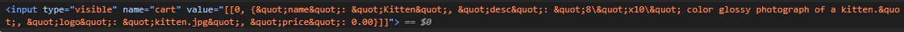

FLAG0
In the cart there seems to be a hidden input box which has info on the items and prices.

There the value can be changed to 0.00 and after the checkout there is the flag.

FLAG1
"There must be a way to administer the app"
With some fuffing found page /login.
```console
┌──(kali㉿kali)-[~]
└─$ ffuf -w /usr/share/wordlists/dirb/big.txt -u https://3942c8cdfd9957f6715efde018b7c759.ctf.hacker101.com/FUZZ -mc 200
```

The page tells you if the username is wrong or if it is the password.
This shouldn't happen because now we can bruteforce the username and then the password.
```console
┌──(kali㉿kali)-[~]
└─$ hydra -L /usr/share/seclists/Usernames/Names/names.txt -p "abc" 3942c8cdfd9957f6715efde018b7c759.ctf.hacker101.com http-post-form "/login:username=^USER^&password=^PASS^:Invalid username" -t 32 -S
```
And after some waiting we got the username

Note! The password isn't abc, it's just a placeholder for the time being. Hydra checks whether or not the response contains "Invalid username" so when the correct username is found, it thinks that the password is also correct.

Now to the password.
```console
┌──(kali㉿kali)-[~]
└─$ hydra -l "trudi" -P /usr/share/wordlists/seclists/Passwords/Common-Credentials/10k-most-common.txt 3942c8cdfd9957f6715efde018b7c759.ctf.hacker101.com http-post-form "/login:username=^USER^&password=^PASS^:Invalid password" -t 32 -S
```
Note! In a more thorough brute you would want to use way bigger list like rockyou or something like that but with my current setup it would take forever.

There we go!
After logging in, there's the flag.

FLAG2
After logging in as admin we can edit the products.
First I tried getting some sort of sqli but no luck.
Good thing the product name seems to be vulnerable to xss.
Adding ```<script>alert(1)</script>``` to the title works and back at the homepage an alert pops up.
After adding the trojan cat to cart and going to /cart, there's the final flag.